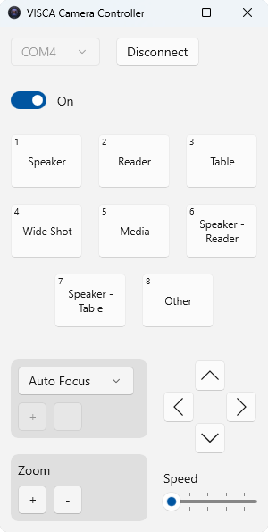

# VISCA Camera Controller

VISCA Camera Controller is a Windows desktop app to control a PTZ camera using the VISCA protocol via a serial communication.

Download the package in the `Releases` section.

 

  
  

